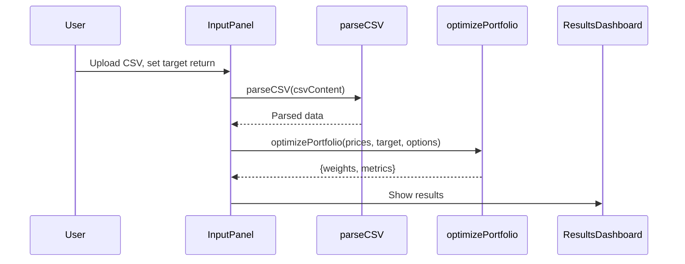

# Portfolio Optimizer Application Architecture

## Overview of the Codebase

### What the App Does
The "Friendly Portfolio Optimizer" is a web application that allows users to upload historical asset price data (in CSV format), specify a target return, and receive an optimized portfolio allocation that minimizes risk (volatility) under linear constraints. The optimization is performed using quadratic programming techniques (KKT system), and results are visualized interactively.

### Tech Stack
- **Frontend Framework:** React 18 (with TypeScript)
- **Build Tool:** Vite
- **Styling:** Tailwind CSS
- **UI Components:** shadcn/ui, Radix UI, Lucide Icons
- **State Management:** React hooks, React Query
- **Routing:** React Router DOM
- **Data Visualization:** Recharts
- **Other:** Custom matrix math and optimization logic (no backend)

### Project Structure
```
├── public/                # Static assets
├── src/
│   ├── components/        # UI components (InputPanel, ResultsDashboard, Header, etc.)
│   ├── contexts/          # React context providers (e.g., ThemeContext)
│   ├── hooks/             # Custom React hooks
│   ├── lib/               # Utility functions
│   ├── pages/             # Page-level components (Index, NotFound)
│   ├── utils/             # Core logic (portfolioOptimizer, csvParser)
│   ├── App.tsx            # App root, routing, providers
│   ├── main.tsx           # Entry point
│   └── index.css          # Global styles
├── index.html             # HTML entry point
├── package.json           # Project metadata and dependencies
└── README.md              # Project documentation
```

## Technical Diagrams

### System Component Diagram
```mermaid
graph TD
    A[User] -->|Uploads CSV, sets target| B[InputPanel]
    B --> C[parseCSV Utility]
    B --> D[AdvancedOptions]
    B --> E[optimizePortfolio Utility]
    E --> F[Matrix Math & KKT Solver]
    E --> G[Portfolio Metrics]
    F --> E
    G --> H[ResultsDashboard]
    H --> I[Recharts Visualization]
    H --> J[UI Feedback (Toasts, Status)]
```

### Data Flow: Portfolio Optimization


### (Optional) Authentication Flow
*This app does not implement authentication; all logic is client-side.*

### (Optional) Database Schema
*No database is used; all data is processed in-memory in the browser.*

## Software Analysis

### Architect Perspective
- **Modularity:** The app is highly modular, with clear separation between UI, logic, and utilities.
- **Extensibility:** Adding new constraints or optimization methods is straightforward due to the encapsulated logic in `portfolioOptimizer.ts` and `AdvancedOptions.tsx`.
- **Scalability:** Suitable for small to medium datasets; for large-scale or multi-user scenarios, a backend would be required.

### Developer Perspective
- **Developer Experience:** Uses modern React patterns, TypeScript for type safety, and Vite for fast development.
- **Testing:** No explicit test files found; recommend adding unit tests for core utilities.
- **Customization:** Easy to add new UI components or tweak optimization logic.

### Product Manager Perspective
- **User Journey:** Simple 3-step flow: upload data → configure target/advanced options → view results.
- **Value Proposition:** Empowers users (e.g., finance professionals, students) to experiment with portfolio optimization without coding or backend setup.
- **Limitations:** No persistent storage, authentication, or multi-user support. All calculations are local to the browser session.

---

*2025-05-31*
