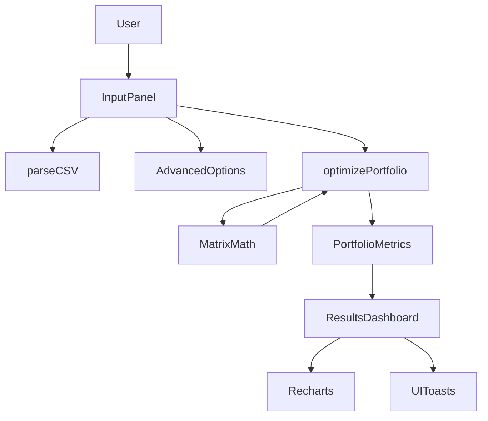
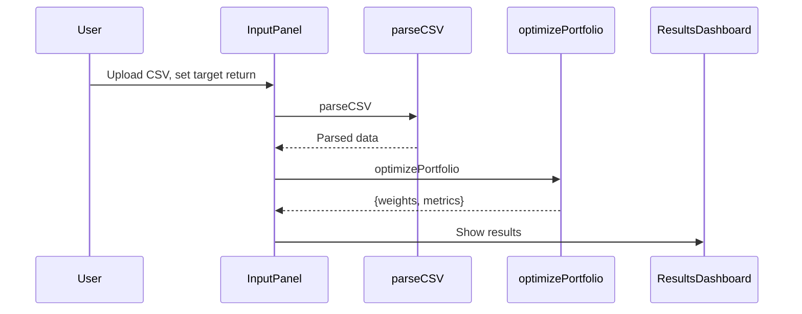

# Portfolio Optimizer: Comprehensive Codebase Overview

## Table of Contents
- [1. Executive Summary](#1-executive-summary)
- [2. Technical Stack](#2-technical-stack)
- [3. Project Structure](#3-project-structure)
- [4. System Architecture](#4-system-architecture)
- [5. Key Components](#5-key-components)
- [6. Data Flow & Diagrams](#6-data-flow--diagrams)
- [7. Perspectives](#7-perspectives)
  - [7.1 Software Architect](#71-software-architect)
  - [7.2 Software Developer](#72-software-developer)
  - [7.3 Product Manager](#73-product-manager)
- [8. Limitations & Recommendations](#8-limitations--recommendations)
- [9. Appendix: Mermaid Diagrams](#9-appendix-mermaid-diagrams)

---

## 1. Executive Summary

The **Friendly Portfolio Optimizer** is a modern, client-side web application for portfolio optimization. Users upload asset price data (CSV), set a target return, and receive an optimized asset allocation that minimizes risk under constraints. The app is built for usability, transparency, and extensibility, with all computations performed in-browser.

## 2. Technical Stack
- **Frontend:** React 18 (TypeScript)
- **Build Tool:** Vite
- **Styling:** Tailwind CSS
- **UI Components:** shadcn/ui, Radix UI, Lucide Icons
- **State Management:** React hooks, React Query
- **Routing:** React Router DOM
- **Visualization:** Recharts
- **Utilities:** Custom matrix math, CSV parsing
- **No backend** (all logic is client-side)

## 3. Project Structure
```
├── public/                # Static assets
├── src/
│   ├── components/        # UI components (InputPanel, ResultsDashboard, Header, etc.)
│   ├── contexts/          # React context providers (e.g., ThemeContext)
│   ├── hooks/             # Custom React hooks
│   ├── lib/               # Utility functions
│   ├── pages/             # Page-level components (Index, NotFound)
│   ├── utils/             # Core logic (portfolioOptimizer, csvParser)
│   ├── App.tsx            # App root, routing, providers
│   ├── main.tsx           # Entry point
│   └── index.css          # Global styles
├── index.html             # HTML entry point
├── package.json           # Project metadata and dependencies
└── README.md              # Project documentation
```

## 4. System Architecture

### High-Level Overview
- **User** interacts with the UI to upload data and configure optimization.
- **InputPanel** handles file upload, target return, and advanced options.
- **CSV is parsed** and validated.
- **Optimization** is performed using custom matrix math and KKT solver.
- **ResultsDashboard** visualizes allocations and metrics.
- **No server or database**; all data is processed in-memory.

### Mermaid: System Component Diagram


## 5. Key Components

### 5.1 UI Components
- **Header:** Branding, theme toggle, and app description.
- **InputPanel:** File upload, target return input, and optimization trigger.
- **AdvancedOptions:** Optional constraints and solver parameters.
- **ResultsDashboard:** Displays results, charts, and status.
- **StepIndicator:** Guides user through the workflow.

### 5.2 Utilities
- **csvParser.ts:** Parses CSV files into asset names, prices, and dates.
- **portfolioOptimizer.ts:** Implements matrix math, KKT system, and portfolio metrics.

### 5.3 Pages
- **Index.tsx:** Main workflow, state management, and orchestration.
- **NotFound.tsx:** 404 page for invalid routes.

### 5.4 Contexts & Hooks
- **ThemeContext:** Manages dark/light mode.
- **use-toast:** Custom hook for UI notifications.

## 6. Data Flow & Diagrams

### 6.1 User Journey
1. User uploads CSV file.
2. App parses and validates data.
3. User sets target return and (optionally) advanced options.
4. App runs optimization and displays results.

### 6.2 Mermaid: Data Flow


## 7. Perspectives

### 7.1 Software Architect
- **Modularity:** Clear separation of UI, logic, and utilities.
- **Extensibility:** New constraints or optimization methods can be added easily.
- **Scalability:** Suitable for small/medium datasets; backend needed for large-scale or persistent use.
- **Security:** No sensitive data leaves the browser; privacy by design.

### 7.2 Software Developer
- **Modern stack:** React, TypeScript, Vite, Tailwind.
- **Reusable components:** UI and logic are decoupled and reusable.
- **Testing:** No explicit tests; recommend adding unit tests for utilities.
- **Customization:** Easy to add new features or UI elements.
- **Dev Experience:** Fast reloads, type safety, and clear structure.

### 7.3 Product Manager
- **User Flow:** Simple, guided 3-step process.
- **Value:** Empowers users to experiment with portfolio optimization without coding or backend setup.
- **Limitations:** No persistent storage, authentication, or multi-user support. All calculations are local.
- **Opportunities:** Add export, save/load, or cloud features for advanced users.

## 8. Limitations & Recommendations
- **No backend:** All logic is client-side; not suitable for sensitive or large-scale data.
- **No authentication:** Anyone can use the app; no user accounts.
- **No persistent storage:** Data is lost on refresh; consider adding local storage or cloud sync.
- **Testing:** Add unit and integration tests for reliability.
- **Accessibility:** Review and improve for a11y best practices.

## 9. Appendix: Mermaid Diagrams

> **Note:** GitHub's Mermaid rendering has limitations. Avoid using labels with parentheses, pipes, or special characters in arrows or node names. See: https://docs.github.com/get-started/writing-on-github/working-with-advanced-formatting/creating-diagrams#creating-mermaid-diagrams

---

*Generated on 2025-05-31 by GitHub Copilot*
