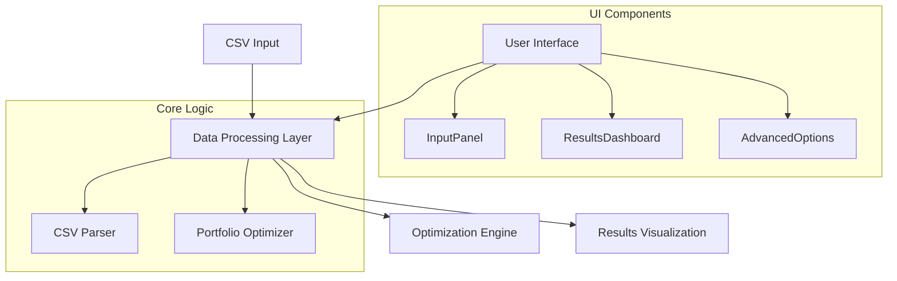
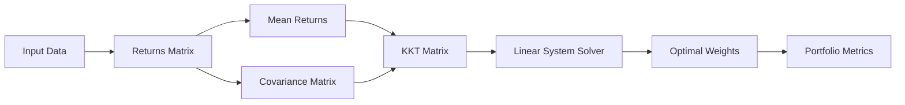
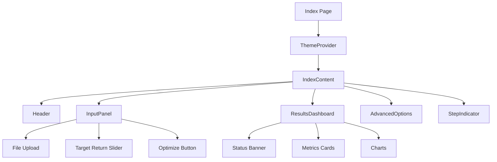
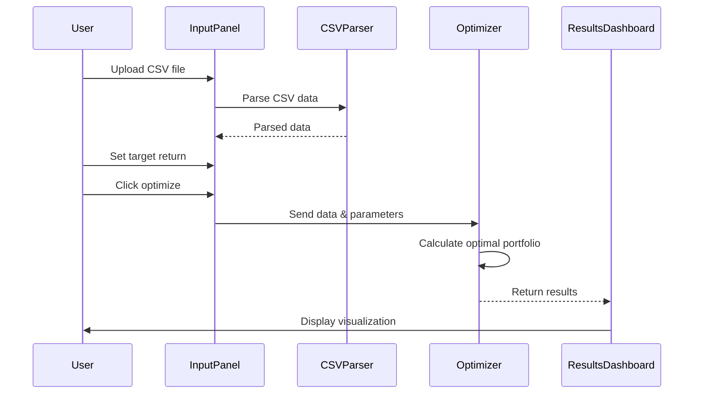

# Portfolio Optimization Application - Technical Documentation

## Table of Contents
1. [System Architecture](#system-architecture)
2. [Core Components](#core-components)
3. [Portfolio Optimization Algorithm](#portfolio-optimization-algorithm)
4. [User Interface](#user-interface)
5. [Data Flow](#data-flow)
6. [Technology Stack](#technology-stack)

## System Architecture

The application follows a modern React-based single-page application architecture with clear separation of concerns between UI components, business logic, and data processing.



## Core Components

### Portfolio Optimizer
The portfolio optimization engine (`portfolioOptimizer.ts`) implements the following key features:



Key optimization steps:
1. Matrix operations for portfolio calculations
2. Returns matrix computation from price data
3. Mean returns calculation
4. Covariance matrix generation
5. KKT (Karush-Kuhn-Tucker) system construction
6. Linear system solving with LU decomposition
7. Portfolio metrics calculation (return, volatility, Sharpe ratio)

### UI Architecture

The application uses a component-based architecture with the following main components:



## Technology Stack

- **Frontend Framework**: React with TypeScript
- **UI Components**: Custom components using tailwindcss
- **Visualization**: Recharts for data visualization
- **State Management**: React hooks and context
- **Styling**: TailwindCSS with dark mode support
- **Math Operations**: Custom matrix operations implementation

## Data Flow



## Portfolio Optimization Algorithm

The algorithm implements Modern Portfolio Theory with the following steps:

1. **Data Preprocessing**
```typescript
// Calculate returns matrix from price data
function calculateReturnsMatrix(prices: number[][]): number[][] {
    const numPeriods = prices.length;
    const numAssets = prices[0].length;
    const returns: number[][] = [];
    // Implementation details...
}
```

2. **Optimization Process**
- Construction of covariance matrix
- Mean returns calculation
- KKT system formulation
- Linear system solving
- Portfolio metrics computation

3. **Constraints Handling**
- Non-negativity constraints
- Sum-to-one constraint
- Target return constraint

## User Interface Components

1. **Input Panel**
   - CSV file upload with drag-and-drop support
   - Target return slider with visual feedback
   - Advanced options toggle
   - Optimization trigger button

2. **Results Dashboard**
   - Portfolio metrics display
   - Interactive charts (Pie chart & Bar chart)
   - Status banner with constraints validation
   - Loading states and animations

3. **Advanced Options**
   - KKT solver parameters
   - Constraint toggles
   - Custom optimization settings

## Performance Considerations

1. **Matrix Operations**
   - Efficient LU decomposition implementation
   - Memory-optimized matrix manipulations
   - Numerical stability checks

2. **UI Performance**
   - Lazy loading of heavy components
   - Optimized chart renderings
   - Responsive design with minimal reflows

## Security & Data Validation

1. **Input Validation**
   - CSV format verification
   - Data type checking
   - Numerical bounds validation

2. **Error Handling**
   - Graceful failure handling
   - User-friendly error messages
   - State recovery mechanisms

## Future Improvements

1. **Algorithm Enhancements**
   - Support for additional optimization objectives
   - Alternative risk measures
   - Multi-period optimization

2. **UI Enhancements**
   - Additional visualization options
   - Export functionality
   - Real-time optimization updates

3. **Performance Optimization**
   - Web worker implementation for heavy calculations
   - Caching mechanisms
   - Progressive loading for large datasets
