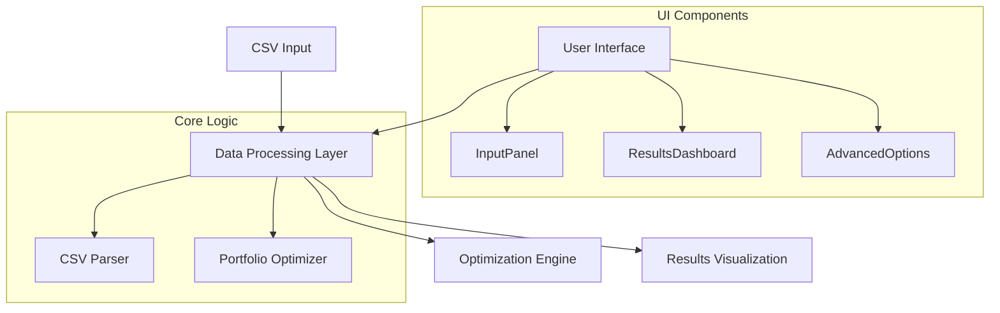
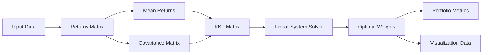
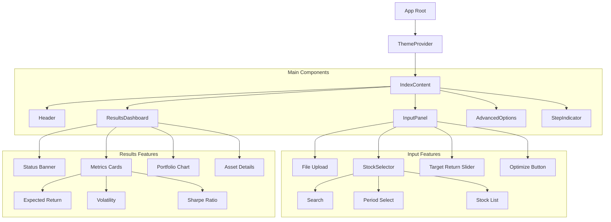
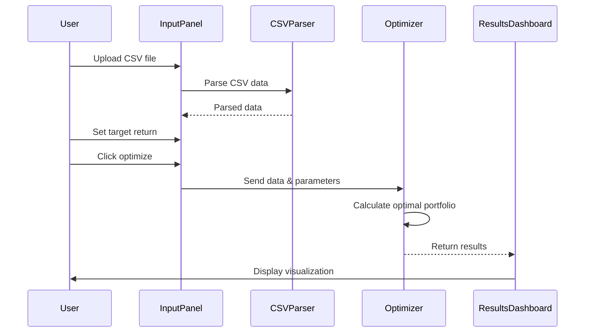

# Portfolio Optimization Application - Technical Documentation

## Table of Contents
1. [System Architecture](#system-architecture)
2. [Core Components](#core-components)
3. [Portfolio Optimization Algorithm](#portfolio-optimization-algorithm)
4. [User Interface](#user-interface)
5. [Data Flow](#data-flow)
6. [Technology Stack](#technology-stack)
7. [Performance & Security](#performance--security)
8. [Future Roadmap](#future-roadmap)

## System Architecture

The application follows a modern React-based single-page application architecture with clear separation of concerns between UI components, business logic, and data processing.



## Core Components

### Portfolio Optimizer
The portfolio optimization engine (`portfolioOptimizer.ts`) implements Modern Portfolio Theory with the following key features:



Key optimization components:

1. Data Processing Layer
   - Price data validation and cleaning
   - Missing data interpolation
   - Outlier detection and handling
   - Returns matrix computation

2. Optimization Core
   - Mean returns calculation with adjustable lookback
   - Covariance matrix with numerical stability
   - KKT system formulation with constraints
   - Multiple solver methods (LU, Cholesky, QR, SVD)

3. Risk Management
   - Portfolio risk metrics computation
   - Sharpe ratio optimization
   - Constraint validation and enforcement
   - Risk-return tradeoff analysis

4. Validation Layer
   - Solution feasibility checks
   - Numerical stability verification
   - Constraint satisfaction testing
   - Performance metrics computation

### UI Architecture

The application implements a modern, component-based architecture with dynamic theming and responsive design:



## Technology Stack

- **Frontend Framework**: React with TypeScript
- **UI Components**: Custom components using tailwindcss
- **Visualization**: Recharts for data visualization
- **State Management**: React hooks and context
- **Styling**: TailwindCSS with dark mode support
- **Math Operations**: Custom matrix operations implementation

## Data Flow



## Portfolio Optimization Algorithm

The algorithm implements Modern Portfolio Theory with the following steps:

1. **Data Preprocessing**
```typescript
// Calculate returns matrix from price data
function calculateReturnsMatrix(prices: number[][]): number[][] {
    const numPeriods = prices.length;
    const numAssets = prices[0].length;
    const returns: number[][] = [];
    // Implementation details...
}
```

2. **Optimization Process**
- Construction of covariance matrix
- Mean returns calculation
- KKT system formulation
- Linear system solving
- Portfolio metrics computation

3. **Constraints Handling**
- Non-negativity constraints
- Sum-to-one constraint
- Target return constraint

## User Interface Components

1. **Input Panel**
   - CSV file upload with drag-and-drop support
   - Target return slider with visual feedback
   - Advanced options toggle
   - Optimization trigger button

2. **Results Dashboard**
   - Portfolio metrics display
   - Interactive charts (Pie chart & Bar chart)
   - Status banner with constraints validation
   - Loading states and animations

3. **Advanced Options**
   - KKT solver parameters
   - Constraint toggles
   - Custom optimization settings

## Performance Considerations

1. **Matrix Operations**
   - Efficient LU decomposition implementation
   - Memory-optimized matrix manipulations
   - Numerical stability checks

2. **UI Performance**
   - Lazy loading of heavy components
   - Optimized chart renderings
   - Responsive design with minimal reflows

## Performance & Security

1. **Performance Optimizations**
   - Lazy loading of heavy components
   - Optimized chart renderings with debouncing
   - Memory-efficient matrix operations
   - Caching strategies for frequently accessed data
   - Responsive design with minimal reflows
   - Background processing for intensive calculations

2. **Security Measures**
   - Input validation for all data sources
   - Numerical stability protection
   - Error boundary implementation
   - Rate limiting for API calls
   - Data sanitization
   - Secure data handling

3. **Error Handling**
   - Graceful degradation
   - User-friendly error messages
   - Automatic error recovery
   - Detailed logging
   - State preservation
   - Error tracking analytics

## Future Roadmap

1. **Q3 2025**
   - Real-time data integration
   - Enhanced visualization options
   - Mobile-optimized interface
   - Portfolio comparison tools
   - Export functionality
   - Advanced charting features

2. **Q4 2025**
   - Multiple optimization strategies
   - Machine learning integration
   - Advanced risk metrics
   - Custom constraint builder
   - Backtesting framework
   - Scenario analysis tools

3. **Q1 2026**
   - Multi-asset class support
   - Advanced portfolio analytics
   - Integration with external tools
   - Collaborative features
   - API access layer
   - Custom strategy development
